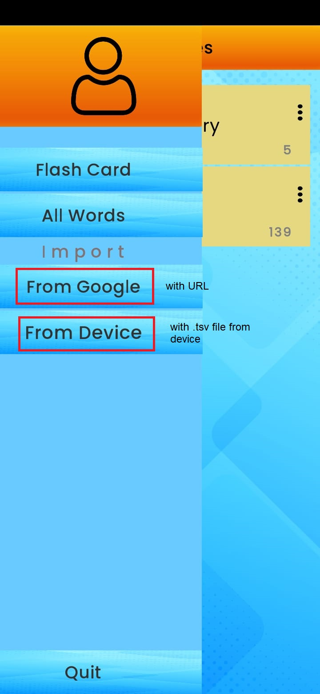

### Word-FlashCard-integrated-with-GoogleSheets-Unity_app is a Flahcard application by that you can learn language, integrated with Google Sheets

  

#### With this app, you can practice the words you want to learn. All you need to do is export the words after translating them using Google Translate.  And again import it into Just Learn It.

#### export the words by using your google translate in its web-site

#### and get the link of your new google-sheets

#### alternatively, you can download the words as a .tsv file and import it into the app on your device.

#### and create your libraries and name these  

